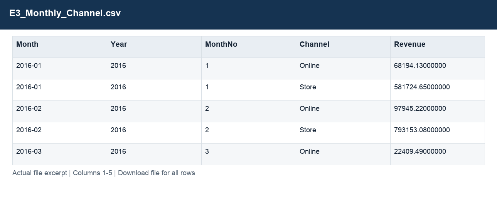
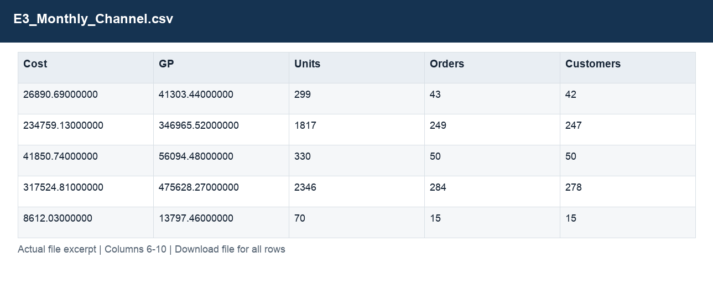
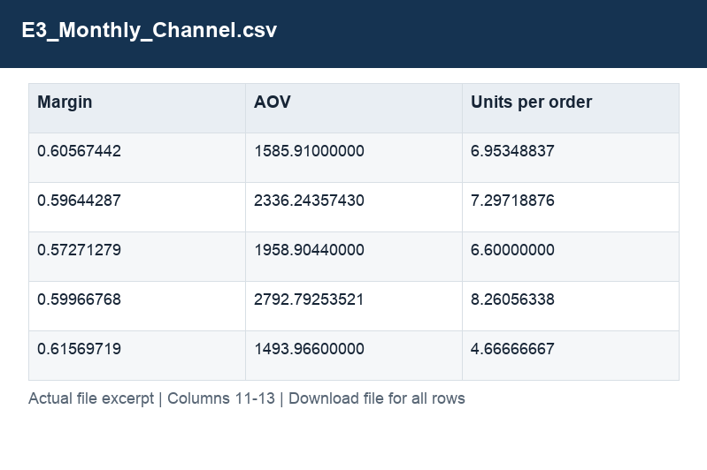

# E3_Monthly_Channel.csv

[Download the complete file](<../outputs/E3_Monthly_Channel.csv>) · [Back to data guide](../README.md)

**Purpose:** Explain order and channel performance over time.

**Rows:** 124. **Fields:** 13. CSV files store text; the type rules below describe how to interpret the values during import. The images render the actual first five records, with wide tables split into consecutive column panels. They are data excerpts, not screenshots of the Excel application.

## Fields and formats

| Field | Meaning / use | Import and display | Example |
|---|---|---|---|
| Month | Month label or month-start key. | Date / period; parse stated order, display YYYY-MM-DD or YYYY-MM | 2016-01 |
| Year | Calendar year. | Numeric; counts as whole numbers, units/durations retain needed decimals | 2016 |
| MonthNo | Month number used for chronological sorting. | Numeric; counts as whole numbers, units/durations retain needed decimals | 1 |
| Channel | Grouping, filter or comparison label for channel. | Text / categorical label; preserve spelling and blanks | Online |
| Revenue | Estimated sales: quantity × static product unit price. | Numeric; preserve full precision, display amount with 2 decimals where applicable | 68194.13000000 |
| Cost | Quantity × unit product cost. | Numeric; preserve full precision, display amount with 2 decimals where applicable | 26890.69000000 |
| GP | Estimated gross profit: revenue less cost. | Numeric; preserve full precision, display amount with 2 decimals where applicable | 41303.44000000 |
| Units | Field retained under its source/output label; interpret with the table purpose and displayed example. | Numeric; counts as whole numbers, units/durations retain needed decimals | 299 |
| Orders | Field retained under its source/output label; interpret with the table purpose and displayed example. | Numeric; counts as whole numbers, units/durations retain needed decimals | 43 |
| Customers | Field retained under its source/output label; interpret with the table purpose and displayed example. | Numeric; counts as whole numbers, units/durations retain needed decimals | 42 |
| Margin | Aggregate profit divided by aggregate sales. | Decimal ratio; display as 0.0% (0.10 = 10%) | 0.60567442 |
| AOV | Revenue divided by distinct orders. | Numeric; preserve full precision, display amount with 2 decimals where applicable | 1585.91000000 |
| Units per order | Total units divided by distinct orders. | Numeric; counts as whole numbers, units/durations retain needed decimals | 6.95348837 |
