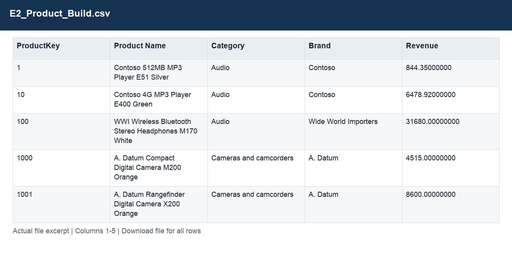
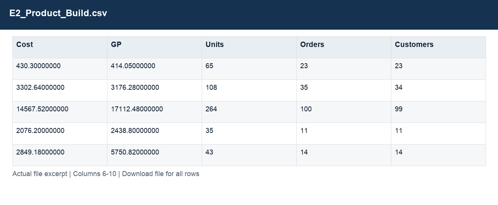
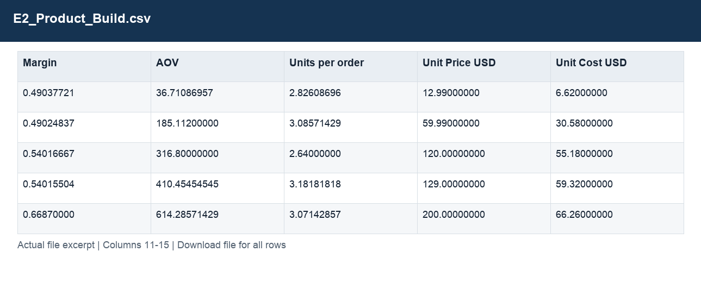

# E2_Product_Build.csv

[Download the complete file](<../outputs/E2_Product_Build.csv>) · [Back to data guide](../README.md)

**Purpose:** Calculate sales, costs and gross profit from quantity and product rates.

**Rows:** 2,492. **Fields:** 15. CSV files store text; the type rules below describe how to interpret the values during import. The images render the actual first five records, with wide tables split into consecutive column panels. They are data excerpts, not screenshots of the Excel application.

## Fields and formats

| Field | Meaning / use | Import and display | Example |
|---|---|---|---|
| ProductKey | Join key for the corresponding dimension; retain source values. | Identifier; preserve as text, including leading zeros | 1 |
| Product Name | Field retained under its source/output label; interpret with the table purpose and displayed example. | Text / categorical label; preserve spelling and blanks | Contoso 512MB MP3 Player E51 Silver |
| Category | Grouping, filter or comparison label for category. | Text / categorical label; preserve spelling and blanks | Audio |
| Brand | Grouping, filter or comparison label for brand. | Text / categorical label; preserve spelling and blanks | Contoso |
| Revenue | Estimated sales: quantity × static product unit price. | Numeric; preserve full precision, display amount with 2 decimals where applicable | 844.35000000 |
| Cost | Quantity × unit product cost. | Numeric; preserve full precision, display amount with 2 decimals where applicable | 430.30000000 |
| GP | Estimated gross profit: revenue less cost. | Numeric; preserve full precision, display amount with 2 decimals where applicable | 414.05000000 |
| Units | Field retained under its source/output label; interpret with the table purpose and displayed example. | Numeric; counts as whole numbers, units/durations retain needed decimals | 65 |
| Orders | Field retained under its source/output label; interpret with the table purpose and displayed example. | Numeric; counts as whole numbers, units/durations retain needed decimals | 23 |
| Customers | Field retained under its source/output label; interpret with the table purpose and displayed example. | Numeric; counts as whole numbers, units/durations retain needed decimals | 23 |
| Margin | Aggregate profit divided by aggregate sales. | Decimal ratio; display as 0.0% (0.10 = 10%) | 0.49037721 |
| AOV | Revenue divided by distinct orders. | Numeric; preserve full precision, display amount with 2 decimals where applicable | 36.71086957 |
| Units per order | Total units divided by distinct orders. | Numeric; counts as whole numbers, units/durations retain needed decimals | 2.82608696 |
| Unit Price USD | Static product list price in USD. | Numeric; preserve full precision, display amount with 2 decimals where applicable | 12.99000000 |
| Unit Cost USD | Static product unit cost in USD. | Numeric; preserve full precision, display amount with 2 decimals where applicable | 6.62000000 |
