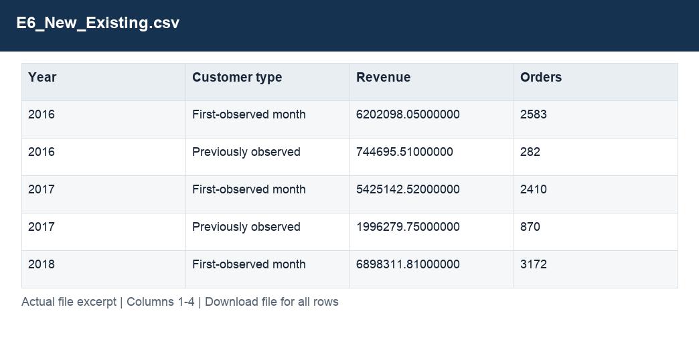

# E6_New_Existing.csv

[Download the complete file](<../outputs/E6_New_Existing.csv>) · [Back to data guide](../README.md)

**Purpose:** Measure repeat purchasing with complete observation windows.

**Rows:** 12. **Fields:** 4. CSV files store text; the type rules below describe how to interpret the values during import. The images render the actual first five records, with wide tables split into consecutive column panels. They are data excerpts, not screenshots of the Excel application.

## Fields and formats

| Field | Meaning / use | Import and display | Example |
|---|---|---|---|
| Year | Calendar year. | Numeric; counts as whole numbers, units/durations retain needed decimals | 2016 |
| Customer type | New versus existing buyer classification. | Text / categorical label; preserve spelling and blanks | First-observed month |
| Revenue | Estimated sales: quantity × static product unit price. | Numeric; preserve full precision, display amount with 2 decimals where applicable | 6202098.05000000 |
| Orders | Field retained under its source/output label; interpret with the table purpose and displayed example. | Numeric; counts as whole numbers, units/durations retain needed decimals | 2583 |
