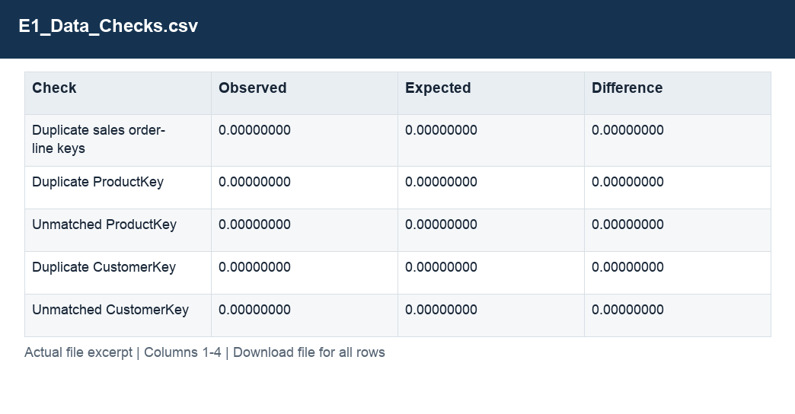

# E1_Data_Checks.csv

[Download the complete file](<../outputs/E1_Data_Checks.csv>) · [Back to data guide](../README.md)

**Purpose:** Validate joins, source coverage and reconciliation.

**Rows:** 26. **Fields:** 4. CSV files store text; the type rules below describe how to interpret the values during import. The images render the actual first five records, with wide tables split into consecutive column panels. They are data excerpts, not screenshots of the Excel application.

## Fields and formats

| Field | Meaning / use | Import and display | Example |
|---|---|---|---|
| Check | Name of the preparation check. | Text / categorical label; preserve spelling and blanks | Duplicate sales order-line keys |
| Observed | Result calculated from the prepared data. | Numeric; preserve full precision, display amount with 2 decimals where applicable | 0.00000000 |
| Expected | Control value used for the reconciliation. | Numeric; preserve full precision, display amount with 2 decimals where applicable | 0.00000000 |
| Difference | Observed result less the expected comparison value. | Numeric; preserve full precision, display amount with 2 decimals where applicable | 0.00000000 |
