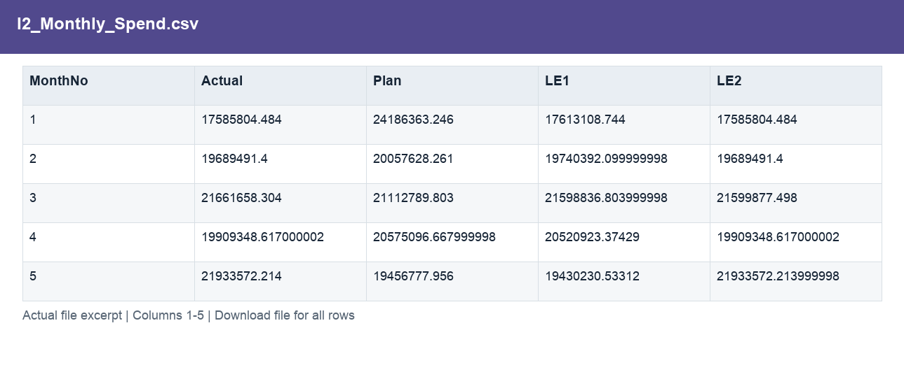
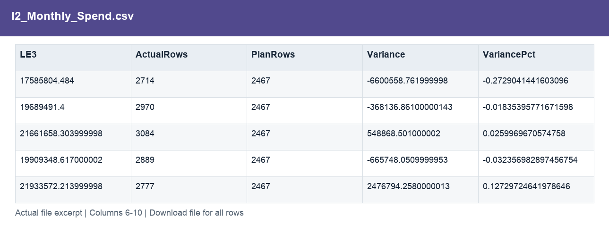
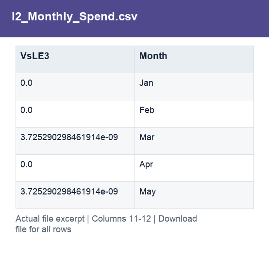

# I2_Monthly_Spend.csv

[Download the complete file](<../outputs/I2_Monthly_Spend.csv>) · [Back to data guide](../README.md)

**Purpose:** Measure spend against plan by month.

**Rows:** 12. **Fields:** 12. CSV files store text; the type rules below describe how to interpret the values during import. The images render the actual first five records, with wide tables split into consecutive column panels. They are data excerpts, not screenshots of the Excel application.

## Fields and formats

| Field | Meaning / use | Import and display | Example |
|---|---|---|---|
| MonthNo | Month number used for chronological sorting. | Numeric; counts as whole numbers, units/durations retain needed decimals | 1 |
| Actual | Actual scenario amount. | Numeric; preserve full precision, display amount with 2 decimals where applicable | 17585804.484 |
| Plan | Planned scenario amount. | Numeric; preserve full precision, display amount with 2 decimals where applicable | 24186363.246 |
| LE1 | Latest estimate version 1. | Numeric; preserve full precision, display amount with 2 decimals where applicable | 17613108.744 |
| LE2 | Latest estimate version 2. | Numeric; preserve full precision, display amount with 2 decimals where applicable | 17585804.484 |
| LE3 | Latest estimate version 3. | Numeric; preserve full precision, display amount with 2 decimals where applicable | 17585804.484 |
| ActualRows | Field retained under its source/output label; interpret with the table purpose and displayed example. | Numeric; counts as whole numbers, units/durations retain needed decimals | 2714 |
| PlanRows | Field retained under its source/output label; interpret with the table purpose and displayed example. | Numeric; counts as whole numbers, units/durations retain needed decimals | 2467 |
| Variance | Actual less Plan. Positive IT cost variance means over plan. | Numeric; preserve full precision, display amount with 2 decimals where applicable | -6600558.761999998 |
| VariancePct | Variance divided by positive Plan; non-positive plans have no ordinary percentage. | Decimal ratio; display as 0.0% (0.10 = 10%) | -0.2729041441603096 |
| VsLE3 | Actual less LE3. | Numeric; preserve full precision, display amount with 2 decimals where applicable | 0.0 |
| Month | Month label or month-start key. | Text / categorical label; preserve spelling and blanks | Jan |
