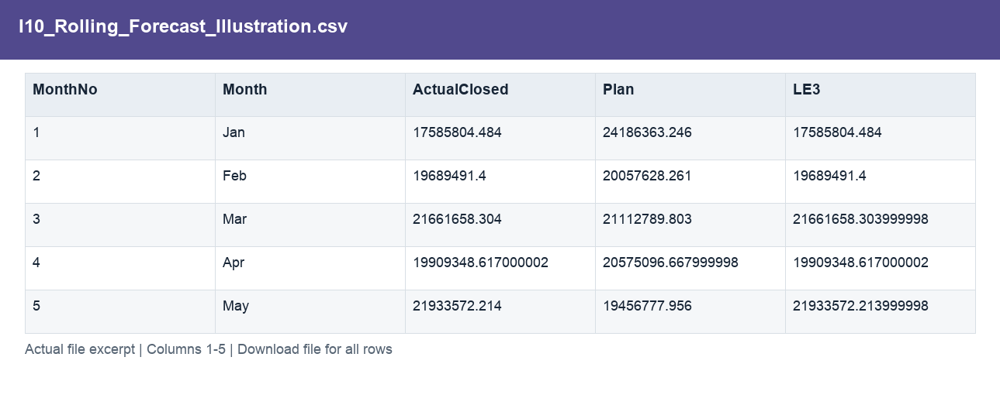
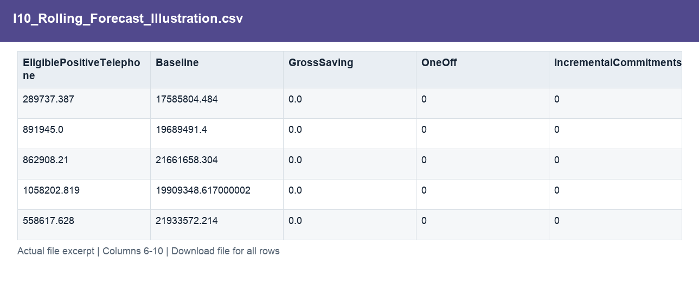
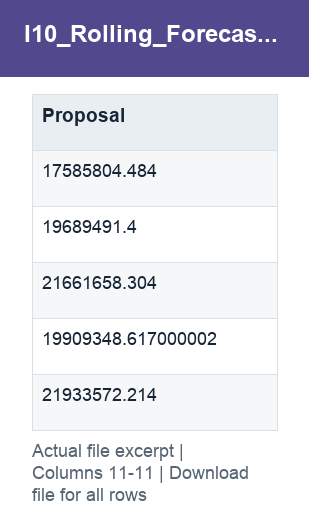

# I10_Rolling_Forecast_Illustration.csv

[Download the complete file](<../outputs/I10_Rolling_Forecast_Illustration.csv>) · [Back to data guide](../README.md)

**Purpose:** Combine closed actuals with remaining estimates and scenario actions.

**Rows:** 12. **Fields:** 11. CSV files store text; the type rules below describe how to interpret the values during import. The images render the actual first five records, with wide tables split into consecutive column panels. They are data excerpts, not screenshots of the Excel application.

## Fields and formats

| Field | Meaning / use | Import and display | Example |
|---|---|---|---|
| MonthNo | Month number used for chronological sorting. | Numeric; counts as whole numbers, units/durations retain needed decimals | 1 |
| Month | Month label or month-start key. | Text / categorical label; preserve spelling and blanks | Jan |
| ActualClosed | Actual spend for the modelled closed months. | Numeric; preserve full precision, display amount with 2 decimals where applicable | 17585804.484 |
| Plan | Planned scenario amount. | Numeric; preserve full precision, display amount with 2 decimals where applicable | 24186363.246 |
| LE3 | Latest estimate version 3. | Numeric; preserve full precision, display amount with 2 decimals where applicable | 17585804.484 |
| EligiblePositiveTelephone | Field retained under its source/output label; interpret with the table purpose and displayed example. | Numeric; preserve full precision, display amount with 2 decimals where applicable | 289737.387 |
| Baseline | Closed actuals plus the remaining estimate. | Numeric; preserve full precision, display amount with 2 decimals where applicable | 17585804.484 |
| GrossSaving | Illustrative gross benefit before implementation costs. | Numeric; preserve full precision, display amount with 2 decimals where applicable | 0.0 |
| OneOff | Illustrative one-time implementation cost. | Numeric; preserve full precision, display amount with 2 decimals where applicable | 0 |
| IncrementalCommitments | Field retained under its source/output label; interpret with the table purpose and displayed example. | Numeric; preserve full precision, display amount with 2 decimals where applicable | 0 |
| Proposal | Baseline less gross savings plus one-off costs and incremental commitments. | Numeric; preserve full precision, display amount with 2 decimals where applicable | 17585804.484 |
