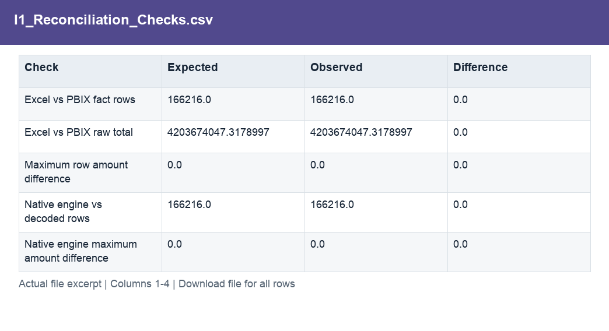

# I1_Reconciliation_Checks.csv

[Download the complete file](<../outputs/I1_Reconciliation_Checks.csv>) · [Back to data guide](../README.md)

**Purpose:** Validate source extraction and data consistency.

**Rows:** 12. **Fields:** 4. CSV files store text; the type rules below describe how to interpret the values during import. The images render the actual first five records, with wide tables split into consecutive column panels. They are data excerpts, not screenshots of the Excel application.

## Fields and formats

| Field | Meaning / use | Import and display | Example |
|---|---|---|---|
| Check | Name of the preparation check. | Text / categorical label; preserve spelling and blanks | Excel vs PBIX fact rows |
| Expected | Control value used for the reconciliation. | Numeric; preserve full precision, display amount with 2 decimals where applicable | 166216.0 |
| Observed | Result calculated from the prepared data. | Numeric; preserve full precision, display amount with 2 decimals where applicable | 166216.0 |
| Difference | Observed result less the expected comparison value. | Numeric; preserve full precision, display amount with 2 decimals where applicable | 0.0 |
