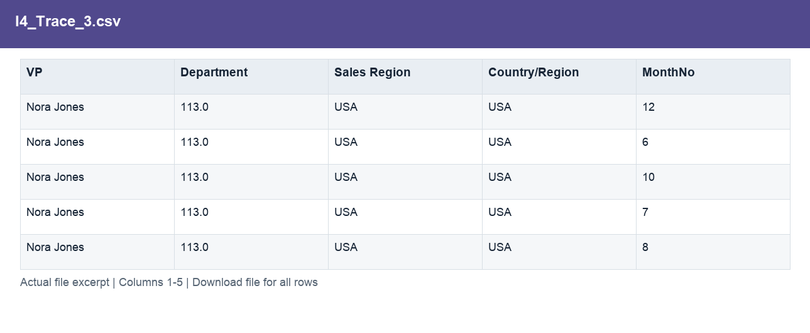
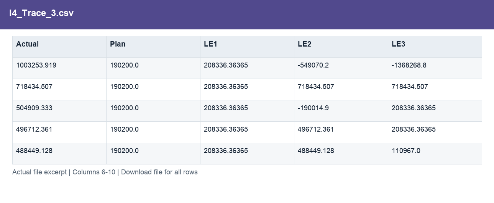
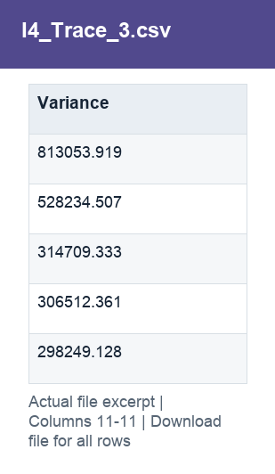

# I4_Trace_3.csv

[Download the complete file](<../outputs/I4_Trace_3.csv>) · [Back to data guide](../README.md)

**Purpose:** Trace material cost variances to reviewable drivers.

**Rows:** 117. **Fields:** 11. CSV files store text; the type rules below describe how to interpret the values during import. The images render the actual first five records, with wide tables split into consecutive column panels. They are data excerpts, not screenshots of the Excel application.

## Fields and formats

| Field | Meaning / use | Import and display | Example |
|---|---|---|---|
| VP | Grouping, filter or comparison label for vp. | Text / categorical label; preserve spelling and blanks | Nora Jones |
| Department | Grouping, filter or comparison label for department. | Numeric; preserve full precision, display amount with 2 decimals where applicable | 113.0 |
| Sales Region | Grouping, filter or comparison label for sales region. | Text / categorical label; preserve spelling and blanks | USA |
| Country/Region | Country/region dimension label. | Text / categorical label; preserve spelling and blanks | USA |
| MonthNo | Month number used for chronological sorting. | Numeric; counts as whole numbers, units/durations retain needed decimals | 12 |
| Actual | Actual scenario amount. | Numeric; preserve full precision, display amount with 2 decimals where applicable | 1003253.919 |
| Plan | Planned scenario amount. | Numeric; preserve full precision, display amount with 2 decimals where applicable | 190200.0 |
| LE1 | Latest estimate version 1. | Numeric; preserve full precision, display amount with 2 decimals where applicable | 208336.36365 |
| LE2 | Latest estimate version 2. | Numeric; preserve full precision, display amount with 2 decimals where applicable | -549070.2 |
| LE3 | Latest estimate version 3. | Numeric; preserve full precision, display amount with 2 decimals where applicable | -1368268.8 |
| Variance | Actual less Plan. Positive IT cost variance means over plan. | Numeric; preserve full precision, display amount with 2 decimals where applicable | 813053.919 |
