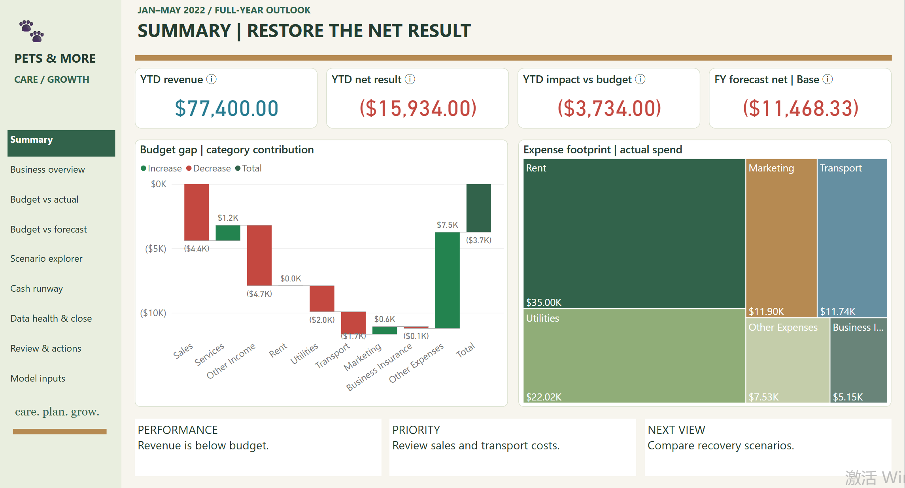
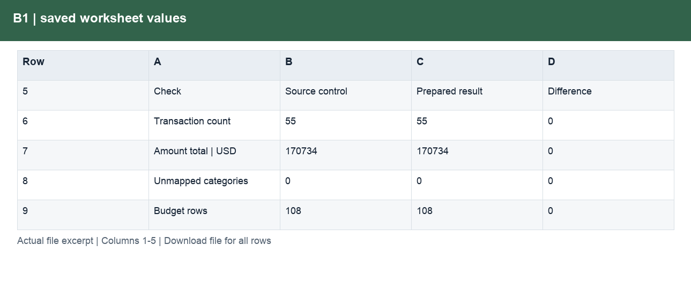
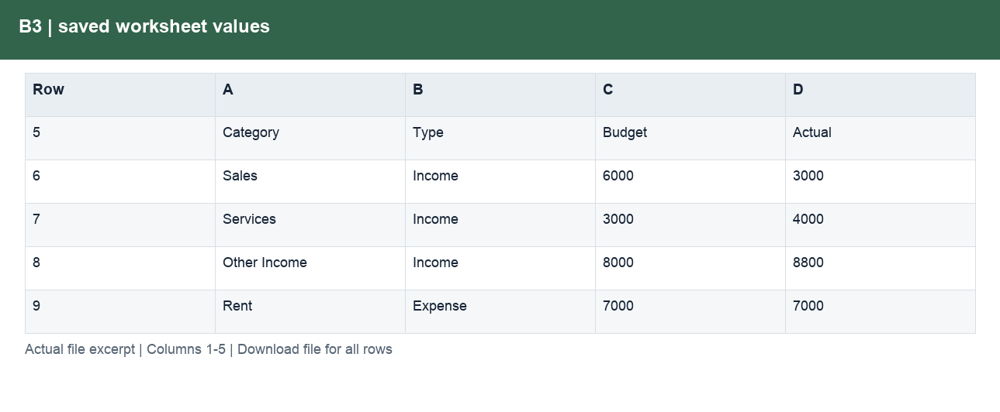
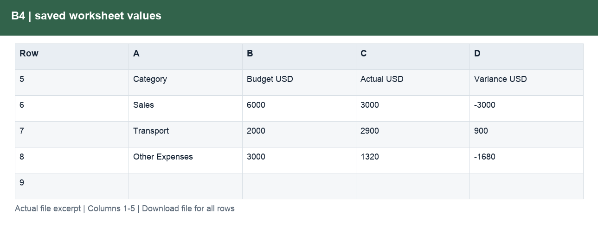
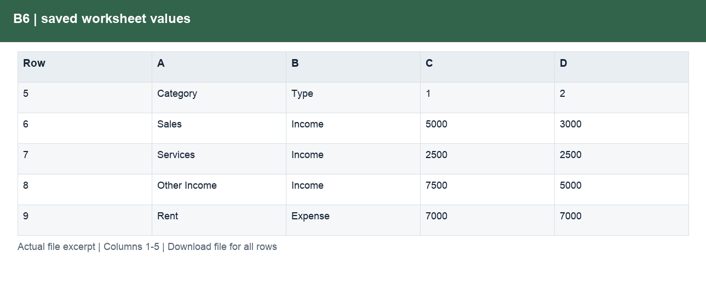
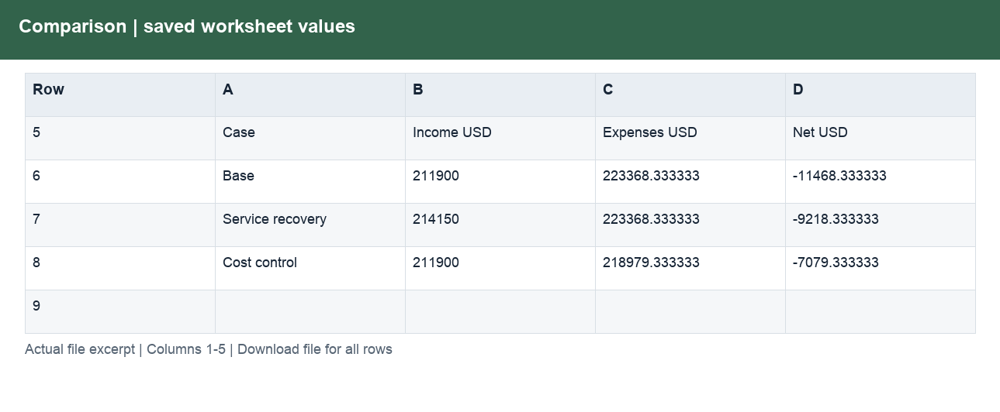
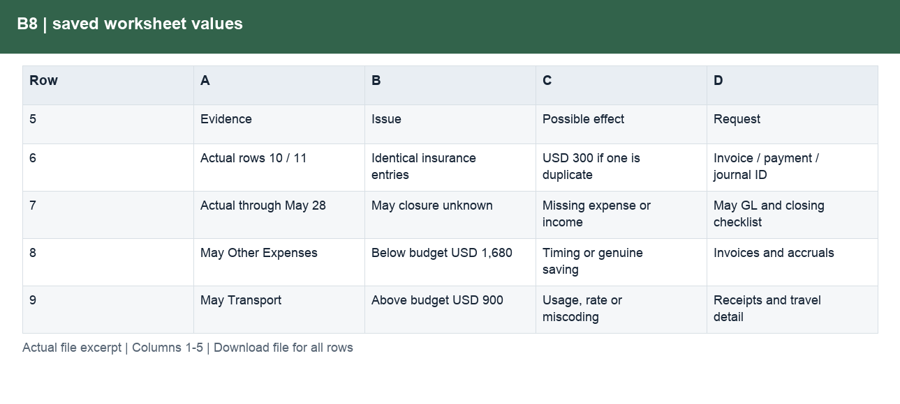
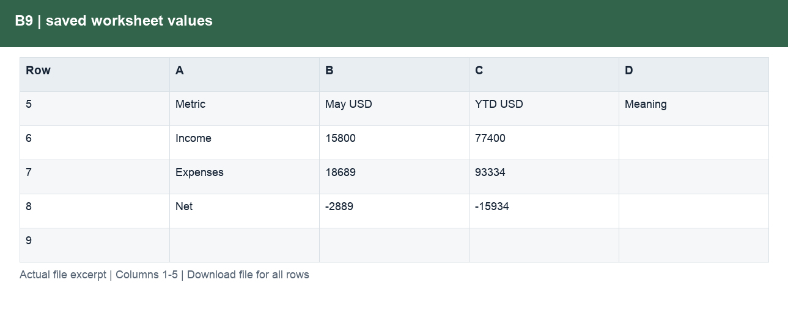
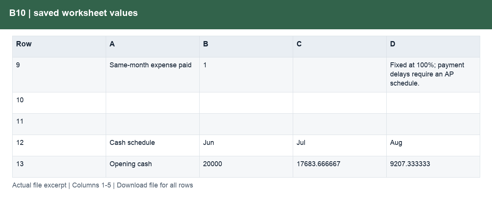

# Pets & More: Budget, Forecast & Cash

[← Portfolio](../../README.md) · [Source Data](../../raw_data/pets-more/README.md) · [Analysis Outputs](../../processed_data/pets-more/README.md)

## Dataset overview

- 55 actual income and expense records, January–May 2022.
- 108 monthly budget records across nine categories, January–December 2022.
- Dates, categories, descriptions and amounts in USD.

[Explore source tables, real data excerpts and field formats →](../../raw_data/pets-more/README.md)

## Analysis questions

- Monthly and YTD variance
- Full-year reforecast
- Recovery scenarios
- Close preparation
- Cash runway

## Prepared data and outputs

[Explore the processed tables, worksheet contents and calculation evidence →](../../processed_data/pets-more/README.md)

The output guide separates prepared inputs, calculation workbooks and analytical outputs. Each illustrated file page explains its purpose and fields.

## Visualisation

[Open the interactive Dashboard](https://app.powerbi.com/view?r=eyJrIjoiZDUxM2MxNDYtMzZhMy00ZDhlLTkzZjQtMGRiYTRlNDMxYjUxIiwidCI6IjljNzNiMWYxLWY0ZGYtNDhkYy05ZDg5LWE0M2NjNjQ4YmJhNSJ9&language=en-US) — no sign-in or dataset download required. Select a page and use its filters to explore the analysis.

[Download Power BI file](report.pbix)

## Results and evidence

### B1 — Can actuals and budget be compared?

**Result.** All 55 actual records and 108 budget rows are retained; all nine categories map successfully.

**How and why.** Map categories and months, exclude budget subtotal rows and reconcile the $170,734 combined transaction control total. This control total includes both income and expenses.

[Inspect the supporting file and field definitions](../../processed_data/pets-more/field_guides/4710152f65.md)

View the supporting data excerpt

### B2 — Which months generated a surplus?

**Result.** March is the only positive month, at $1,700; YTD income less expenses is ($15,934).

**How and why.** Sum income and expense categories separately for each month, then subtract expenses from income.

[Inspect the supporting file and field definitions](../../processed_data/pets-more/field_guides/6b09eb26ef.md)

View the supporting data excerpt

### B3 — How did May perform against budget?

**Result.** May income was $1,200 below budget and expenses $811 below budget, leaving a $389 unfavourable net variance.

**How and why.** Compare May with May. Reverse expense variances when calculating their contribution to the net result.

[Inspect the supporting file and field definitions](../../processed_data/pets-more/field_guides/6c9b7e1dbb.md)

View the supporting data excerpt

### B4 — What deserves immediate review?

**Result.** May Sales is $3,000 below plan, Transport is $900 above plan, and Other Expenses is $1,680 below plan.

**How and why.** Rank material dollar gaps, inspect transaction descriptions and identify evidence needed to distinguish timing from operational changes.

[Inspect the supporting file and field definitions](../../processed_data/pets-more/field_guides/4e494bbe31.md)

View the supporting data excerpt

### B5 — What explains the YTD gap?

**Result.** The YTD result is $3,734 worse than budget. Sales and Other Income contribute $4,400 and $4,700 of downside, partly offset by $7,470 lower Other Expenses.

**How and why.** Sum January–May actuals and matching budgets by category; reconcile signed contributions to the total net gap.

[Inspect the supporting file and field definitions](../../processed_data/pets-more/field_guides/4f1a41b2e5.md)

View the supporting data excerpt

### B6 — What is the revised full-year result?

**Result.** The base forecast is ($11,468.33), an improvement of $2,731.67 versus the original ($14,200) budget.

**How and why.** Keep January–May actuals and add June–December estimates using the documented category assumptions.

[Inspect the supporting file and field definitions](../../processed_data/pets-more/field_guides/340f921e89.md)

View the supporting data excerpt

### B7 — Which recovery scenario improves the model most?

**Result.** Service recovery improves the result by $2,250; the cost-control scenario improves it by $4,389. All three scenarios remain in deficit.

**How and why.** Change only future-period drivers. Compare each evaluated case with the same base; the workbook comparison is a saved scenario snapshot.

[Inspect the supporting file and field definitions](../../processed_data/pets-more/field_guides/4a0dce2d95.md)

View the supporting data excerpt

### B8 — What should be checked before close?

**Result.** Two identical $300 insurance entries and potential timing/completeness issues are flagged; no unsupported correction is posted.

**How and why.** Compare record attributes and request invoices, ledger balances and accrual evidence. A duplicate-looking record is not proof of duplicate accounting.

[Inspect the supporting file and field definitions](../../processed_data/pets-more/field_guides/bb44cca228.md)

View the supporting data excerpt

### B9 — What should the business review focus on?

**Result.** The review prioritises Sales, Transport and Other Expenses and links them to the full-year forecast.

**How and why.** Combine monthly and YTD evidence with a specific question, proposed owner role and next step; no meeting outcome is invented.

[Inspect the supporting file and field definitions](../../processed_data/pets-more/field_guides/1a4d21dfdf.md)

View the supporting data excerpt

### B10 — When could funding be needed?

**Result.** The illustrative model needs $1,121.67 in October to maintain a $5,000 cash floor.

**How and why.** Roll opening cash plus modelled collections less payments, tax and capex. This depends on the stated opening cash and collection assumptions.

[Inspect the supporting file and field definitions](../../processed_data/pets-more/field_guides/bd66ba59ac.md)

View the supporting data excerpt

## Source and measurement notes

**Period:** January–May 2022 actuals; January–December 2022 budget.  
**Scope:** 55 actual records and 108 monthly category budgets.  
**Source:** [Arnav Chaturvedi — Budget vs Actuals model](https://github.com/arnavchaturvedi17/FinancialAnalysis-Variance-Model-Simple-Budget-vs-Actuals-).

Public practice model; the company identity and operational history are not independently verified. May is treated as complete for the exercise. Forecasts, cash timing and funding assumptions are illustrative. Close checks and review questions are preparation work, not an audit or completed business meeting.

