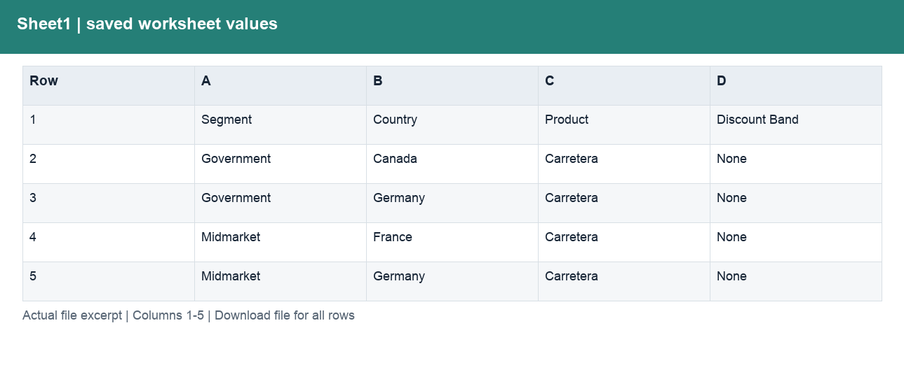
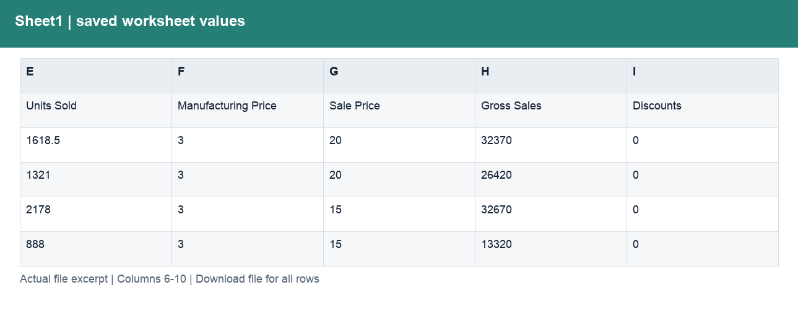
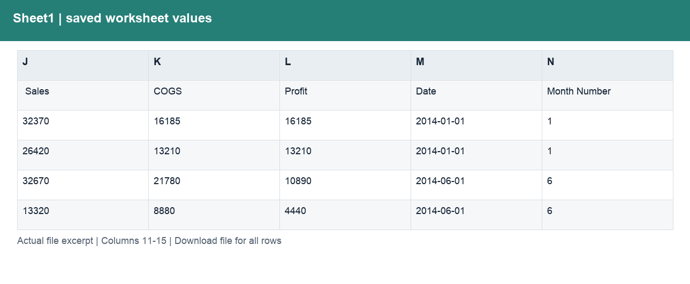
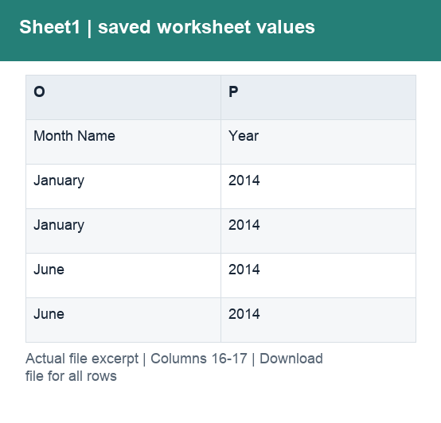

# Financial_Sample_Original.xlsx

[Download workbook](<../Financial_Sample_Original.xlsx>) · [Back to data guide](../README.md)

This page renders saved cell values from the actual workbook. Excel workbooks mix schedules, assumptions and tables, so formats are documented by worksheet and column rather than treating the whole file as one dataset. No calculations or source cells were changed for these illustrations.

## Sheet1

Provide a prepared table for consistent joins, filtering and analysis.

| Column | Labels / sample content | Stored type and Excel number format |
|---|---|---|
| A | Segment; Government; Government | str; General |
| B | Country; Canada; Germany | str; General |
| C | Product; Carretera; Carretera | str; _("$"* #,##0.00_);_("$"* \(#,##0.00\);_("$"* "-"??_);_(@_) |
| D | Discount Band; None; None | str; _("$"* #,##0.00_);_("$"* \(#,##0.00\);_("$"* "-"??_);_(@_) |
| E | Units Sold | float, int, str; General |
| F | Manufacturing Price | int, str; _("$"* #,##0.00_);_("$"* \(#,##0.00\);_("$"* "-"??_);_(@_) |
| G | Sale Price | int, str; _("$"* #,##0.00_);_("$"* \(#,##0.00\);_("$"* "-"??_);_(@_) |
| H | Gross Sales | float, int, str; _("$"* #,##0.00_);_("$"* \(#,##0.00\);_("$"* "-"??_);_(@_) |
| I | Discounts | int, str; _("$"* #,##0.00_);_("$"* \(#,##0.00\);_("$"* "-"??_);_(@_) |
| J |  Sales | float, int, str; _("$"* #,##0.00_);_("$"* \(#,##0.00\);_("$"* "-"??_);_(@_) |
| K | COGS | int, str; _("$"* #,##0.00_);_("$"* \(#,##0.00\);_("$"* "-"??_);_(@_) |
| L | Profit | float, int, str; _("$"* #,##0.00_);_("$"* \(#,##0.00\);_("$"* "-"??_);_(@_) |
| M | Date | datetime, str; mm-dd-yy |
| N | Month Number | int, str; 0 |
| O | Month Name; January; January | str; _("$"* #,##0.00_);_("$"* \(#,##0.00\);_("$"* "-"??_);_(@_) |
| P | Year; 2014; 2014 | str; @ |

Column labels may change between sections lower in the worksheet. Download the workbook to follow those schedules and formulas; the illustration shows only the opening populated section.

