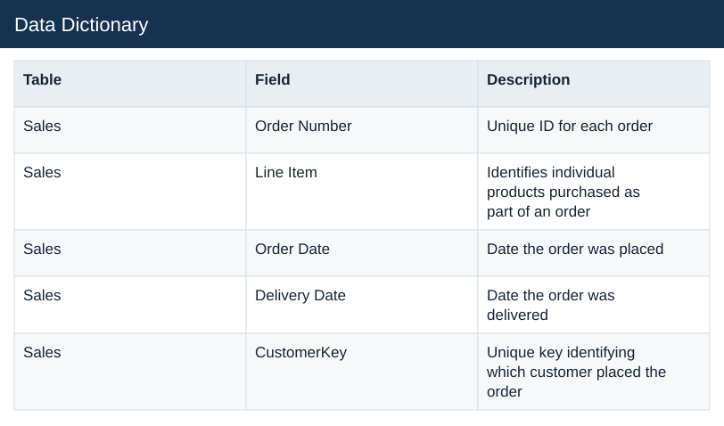

# Data Dictionary

[Download data](<../Data_Dictionary.csv>) · [Back to data](../README.md)

## Data Dictionary

Inspect the original Data_Dictionary source table before preparation.

### Fields

| Field | Format | Example |
|---|---|---|
| Table | Text | Sales |
| Field | Text | Order Number |
| Description | Text | Unique ID for each order |

