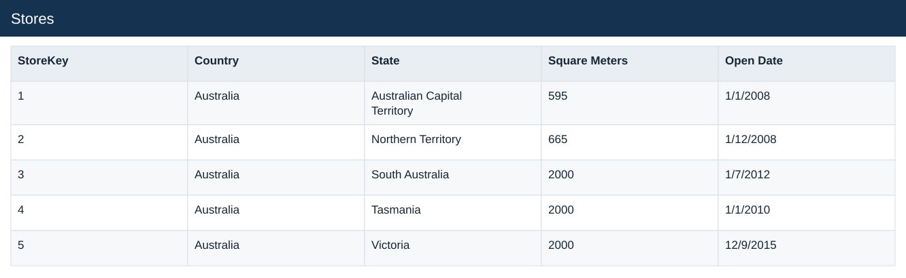

# Stores

[Download data](<../Stores.csv>) · [Back to data](../README.md)

## Stores

Inspect the original Stores source table before preparation.

### Fields

| Field | Format | Example |
|---|---|---|
| StoreKey | Number | 1 |
| Country | Text | Australia |
| State | Text | Australian Capital Territory |
| Square Meters | Number | 595 |
| Open Date | Text | 1/1/2008 |

