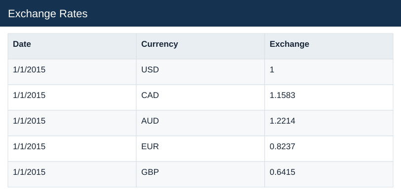

# Exchange Rates

[Download data](<../Exchange_Rates.csv>) · [Back to data](../README.md)

## Exchange Rates

Inspect the original Exchange_Rates source table before preparation.

### Fields

| Field | Meaning | Format | Example |
|---|---|---|---|
| Date | — | Text | 1/1/2015 |
| Currency | — | Text | USD |
| Exchange | Source exchange-rate factor; preserve the documented direction. | Number | 1 |

