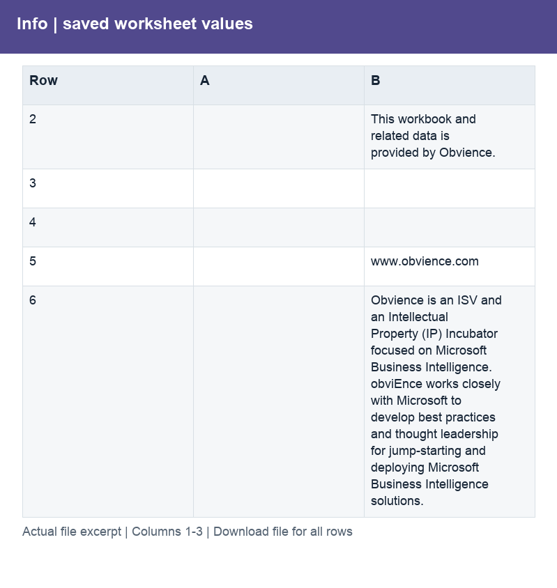

# IT_Spend_Analysis_Original.xlsx

[Download workbook](../IT_Spend_Analysis_Original.xlsx) · [Back to data guide](../README.md)

This page renders saved cell values from the actual workbook. Excel workbooks mix schedules, assumptions and tables, so formats are documented by worksheet and column rather than treating the whole file as one dataset. No calculations or source cells were changed for these illustrations.

## Info

Provide a prepared table for consistent joins, filtering and analysis.

| Column | Labels / sample content | Stored type and Excel number format |
|---|---|---|
| A | Numeric schedule values | ;  |
| B | This workbook and related data is provided by Obvience.; www.obvience.com; Obvience is an ISV and an Intellectual Property (IP) Incubator focused on Microsoft Business Intelligence.  obviEnce works closely with Microsoft to develop best practices and thought leadership for jump-starting and deploying Microsoft Business Intelligence solutions.  | str; General |

Column labels may change between sections lower in the worksheet. Download the workbook to follow those schedules and formulas; the illustration shows only the opening populated section.

