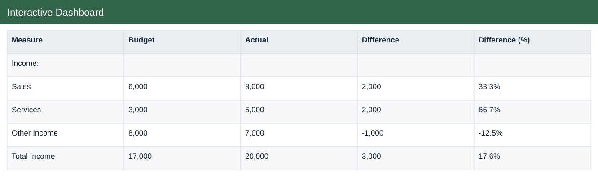
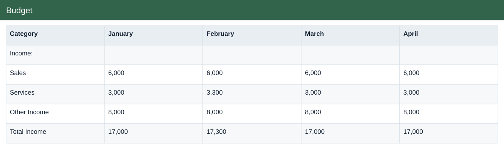
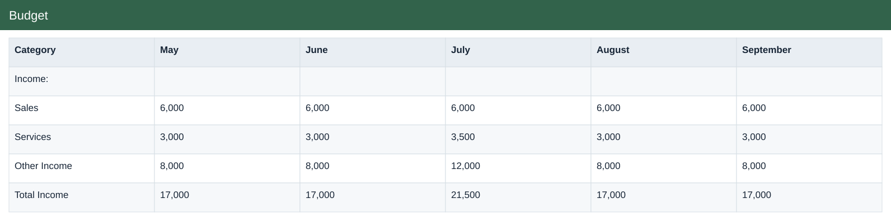
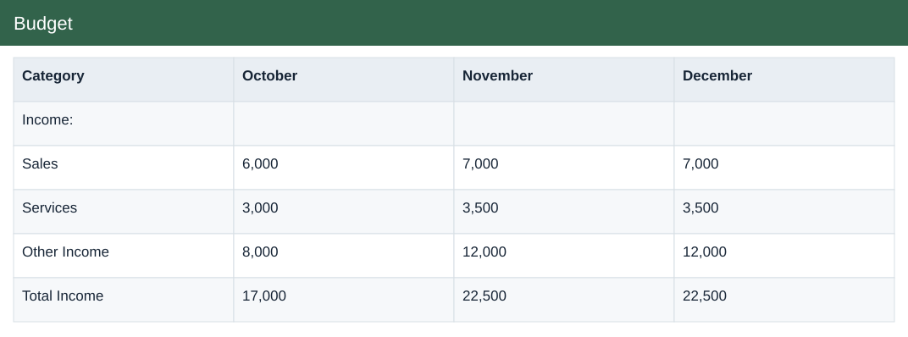
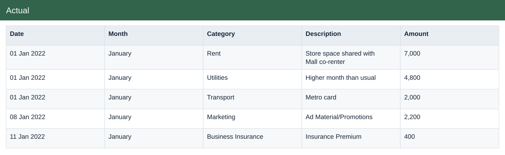

# Budget vs Actuals Original

[Download Excel file](<../Budget_vs_Actuals_Original.xlsx>) · [Back to data](../README.md)

## Interactive Dashboard

Interactive Dashboard: a preview of the figures in the workbook.

### Fields

| Field | Format | Example |
|---|---|---|
| Measure | Text | Income: |
| Budget | Whole number | 6,000 |
| Actual | Whole number | 8,000 |
| Difference | Whole number | 2,000 |
| Difference (%) | Percentage | 33.3% |

## Budget

Planned income and expenses by month and category.

### Fields

| Field | Format | Example |
|---|---|---|
| Category | Text | Income: |
| January | Whole number | 6,000 |
| February | Whole number | 6,000 |
| March | Whole number | 6,000 |
| April | Whole number | 6,000 |
| May | Whole number | 6,000 |
| June | Whole number | 6,000 |
| July | Whole number | 6,000 |
| August | Whole number | 6,000 |
| September | Whole number | 6,000 |
| October | Whole number | 6,000 |
| November | Whole number | 7,000 |
| December | Whole number | 7,000 |

## Actual

Actual income and expenses recorded by date and category.

### Fields

| Field | Format | Example |
|---|---|---|
| Date | Date | 01 Jan 2022 |
| Month | Text | January |
| Category | Text | Rent |
| Description | Text | Store space shared with Mall co-renter |
| Amount | Whole number | 7,000 |

