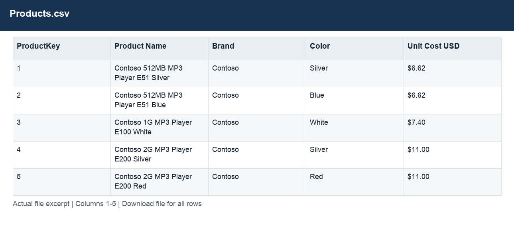
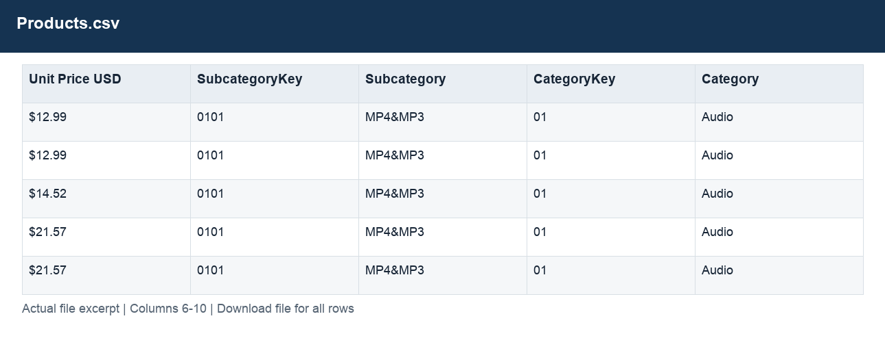

# Products.csv

[Download the complete file](../Products.csv) · [Back to data guide](../README.md)

**Purpose:** Inspect the original Products source table before preparation.

**Rows:** 2,517. **Fields:** 10. CSV files store text; the type rules below describe how to interpret the values during import. The images render the actual first five records, with wide tables split into consecutive column panels. They are data excerpts, not screenshots of the Excel application.

## Fields and formats

| Field | Meaning / use | Import and display | Example |
|---|---|---|---|
| ProductKey | Join key for the corresponding dimension; retain source values. | Identifier; preserve as text, including leading zeros | 1 |
| Product Name | Field retained under its source/output label; interpret with the table purpose and displayed example. | Text / categorical label; preserve spelling and blanks | Contoso 512MB MP3 Player E51 Silver |
| Brand | Grouping, filter or comparison label for brand. | Text / categorical label; preserve spelling and blanks | Contoso |
| Color | Field retained under its source/output label; interpret with the table purpose and displayed example. | Text / categorical label; preserve spelling and blanks | Silver |
| Unit Cost USD | Static product unit cost in USD. | Numeric; preserve full precision, display amount with 2 decimals where applicable | $6.62  |
| Unit Price USD | Static product list price in USD. | Numeric; preserve full precision, display amount with 2 decimals where applicable | $12.99  |
| SubcategoryKey | Join key for the corresponding dimension; retain source values. | Identifier; preserve as text, including leading zeros | 0101 |
| Subcategory | Grouping, filter or comparison label for subcategory. | Text / categorical label; preserve spelling and blanks | MP4&MP3 |
| CategoryKey | Join key for the corresponding dimension; retain source values. | Identifier; preserve as text, including leading zeros | 01 |
| Category | Grouping, filter or comparison label for category. | Text / categorical label; preserve spelling and blanks | Audio |
