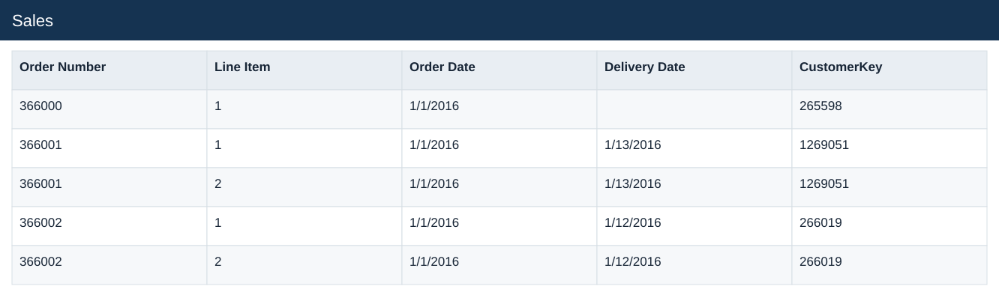
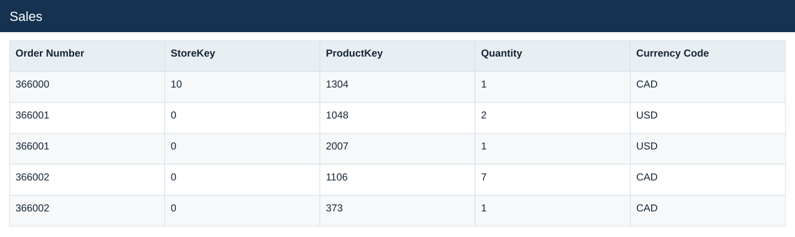

# Sales

[Download data](<../Sales.csv>) · [Back to data](../README.md)

## Sales

Inspect the original Sales source table before preparation.

### Fields

| Field | Meaning | Format | Example |
|---|---|---|---|
| Order Number | Order identifier; one order can contain several sales lines. | Number | 366000 |
| Line Item | Line identifier within the order. | Number | 1 |
| Order Date | — | Text | 1/1/2016 |
| Delivery Date | — | Text | 1/13/2016 |
| CustomerKey | — | Number | 265598 |
| StoreKey | — | Number | 10 |
| ProductKey | — | Number | 1304 |
| Quantity | Units on the sales line. | Number | 1 |
| Currency Code | — | Text | CAD |

