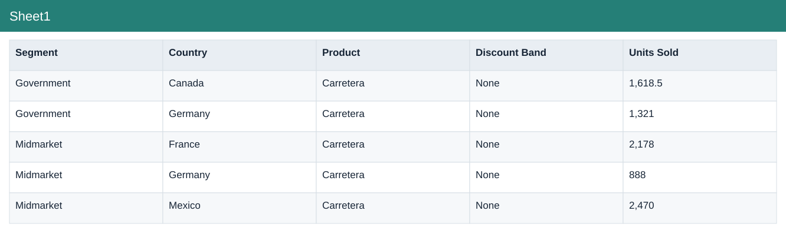
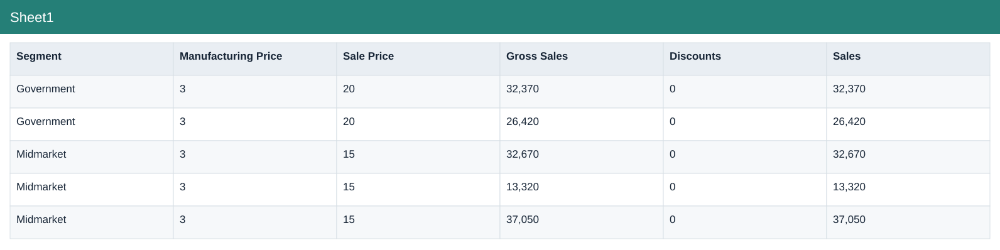
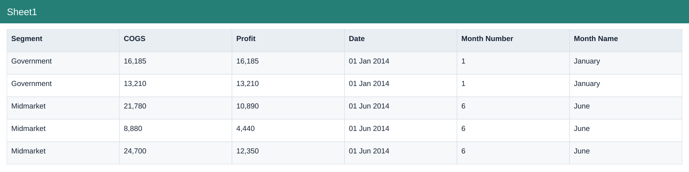
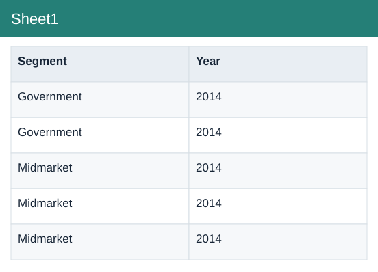

# Financial Sample Original

[Download Excel file](<../Financial_Sample_Original.xlsx>) · [Back to data](../README.md)

## Sheet1

Sheet1: a preview of the figures in the workbook.

### Fields

| Field | Format | Example |
|---|---|---|
| Segment | Text | Government |
| Country | Text | Canada |
| Product | Text | Carretera |
| Discount Band | Text | None |
| Units Sold | Number (2 decimals) | 1,618.5 |
| Manufacturing Price | Whole number | 3 |
| Sale Price | Whole number | 20 |
| Gross Sales | Whole number | 32,370 |
| Discounts | Whole number | 0 |
|  Sales | Whole number | 32,370 |
| COGS | Whole number | 16,185 |
| Profit | Whole number | 16,185 |
| Date | Date | 01 Jan 2014 |
| Month Number | Whole number | 1 |
| Month Name | Text | January |
| Year | Number | 2014 |

