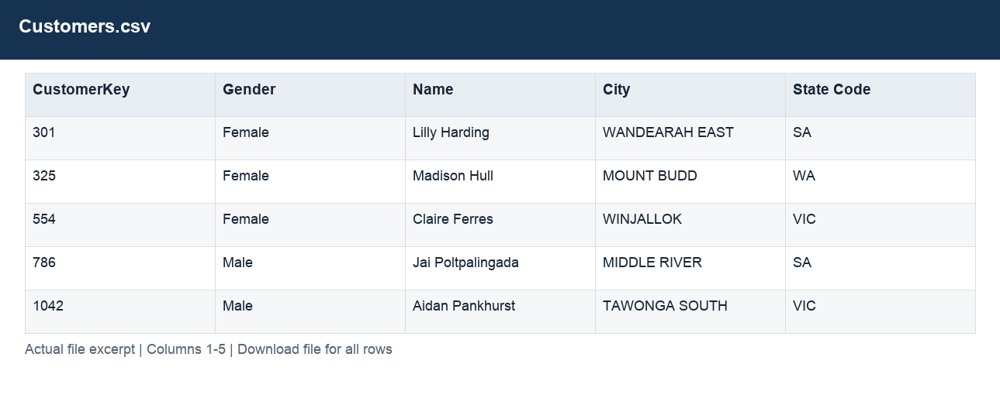
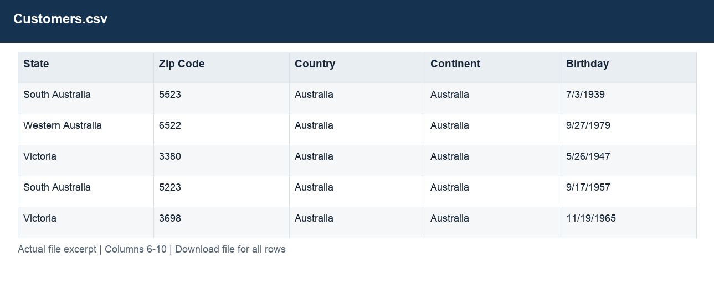

# Customers.csv

[Download the complete file](<../Customers.csv>) · [Back to data guide](../README.md)

**Purpose:** Inspect the original Customers source table before preparation.

**Rows:** 15,266. **Fields:** 10. CSV files store text; the type rules below describe how to interpret the values during import. The images render the actual first five records, with wide tables split into consecutive column panels. They are data excerpts, not screenshots of the Excel application.

## Fields and formats

| Field | Meaning / use | Import and display | Example |
|---|---|---|---|
| CustomerKey | Join key for the corresponding dimension; retain source values. | Identifier; preserve as text, including leading zeros | 301 |
| Gender | Grouping, filter or comparison label for gender. | Text / categorical label; preserve spelling and blanks | Female |
| Name | Field retained under its source/output label; interpret with the table purpose and displayed example. | Text / categorical label; preserve spelling and blanks | Lilly Harding |
| City | Field retained under its source/output label; interpret with the table purpose and displayed example. | Text / categorical label; preserve spelling and blanks | WANDEARAH EAST |
| State Code | Field retained under its source/output label; interpret with the table purpose and displayed example. | Identifier; preserve as text, including leading zeros | SA |
| State | Field retained under its source/output label; interpret with the table purpose and displayed example. | Text / categorical label; preserve spelling and blanks | South Australia |
| Zip Code | Field retained under its source/output label; interpret with the table purpose and displayed example. | Identifier; preserve as text, including leading zeros | 5523 |
| Country | Grouping, filter or comparison label for country. | Text / categorical label; preserve spelling and blanks | Australia |
| Continent | Field retained under its source/output label; interpret with the table purpose and displayed example. | Text / categorical label; preserve spelling and blanks | Australia |
| Birthday | Field retained under its source/output label; interpret with the table purpose and displayed example. | Date / period; parse stated order, display YYYY-MM-DD or YYYY-MM | 7/3/1939 |
