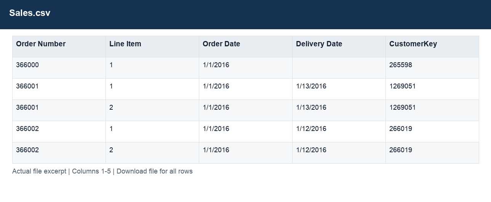
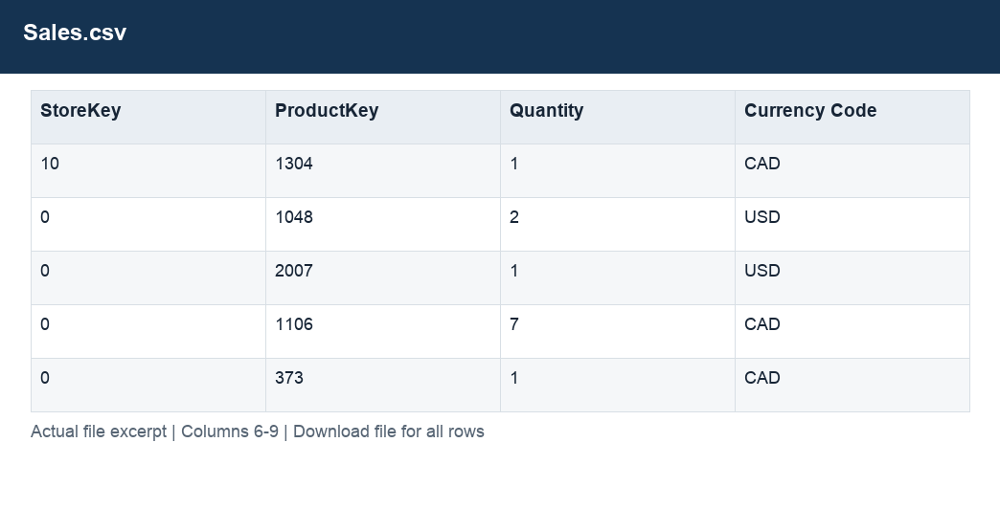

# Sales.csv

[Download the complete file](<../Sales.csv>) · [Back to data guide](../README.md)

**Purpose:** Inspect the original Sales source table before preparation.

**Rows:** 62,884. **Fields:** 9. CSV files store text; the type rules below describe how to interpret the values during import. The images render the actual first five records, with wide tables split into consecutive column panels. They are data excerpts, not screenshots of the Excel application.

## Fields and formats

| Field | Meaning / use | Import and display | Example |
|---|---|---|---|
| Order Number | Order identifier; one order can contain several sales lines. | Identifier; preserve as text, including leading zeros | 366000 |
| Line Item | Line identifier within the order. | Numeric; preserve full precision, display amount with 2 decimals where applicable | 1 |
| Order Date | Field retained under its source/output label; interpret with the table purpose and displayed example. | Date / period; parse stated order, display YYYY-MM-DD or YYYY-MM | 1/1/2016 |
| Delivery Date | Field retained under its source/output label; interpret with the table purpose and displayed example. | Date / period; parse stated order, display YYYY-MM-DD or YYYY-MM | 1/13/2016 |
| CustomerKey | Join key for the corresponding dimension; retain source values. | Identifier; preserve as text, including leading zeros | 265598 |
| StoreKey | Join key for the corresponding dimension; retain source values. | Identifier; preserve as text, including leading zeros | 10 |
| ProductKey | Join key for the corresponding dimension; retain source values. | Identifier; preserve as text, including leading zeros | 1304 |
| Quantity | Units on the sales line. | Numeric; counts as whole numbers, units/durations retain needed decimals | 1 |
| Currency Code | Grouping, filter or comparison label for currency code. | Identifier; preserve as text, including leading zeros | CAD |
