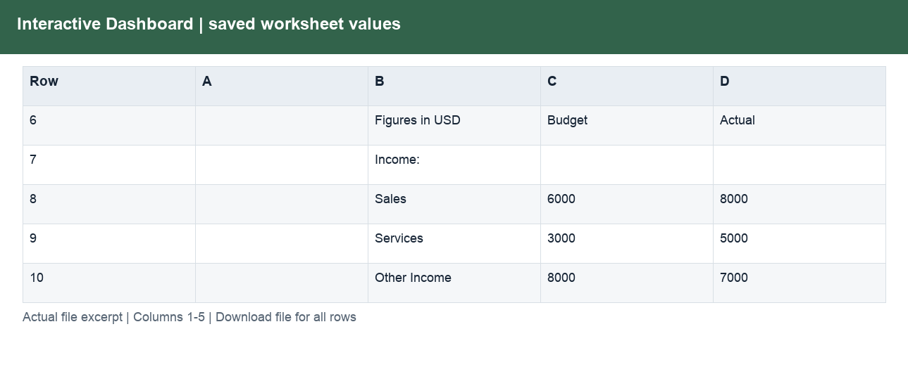
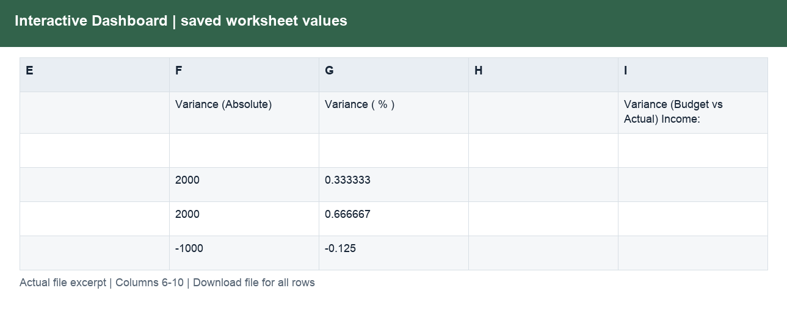
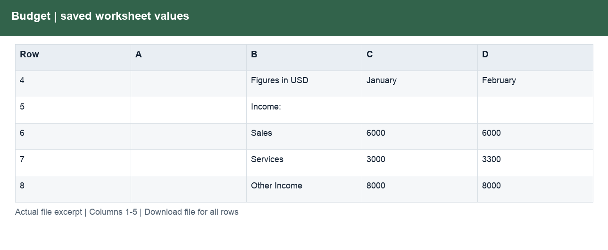
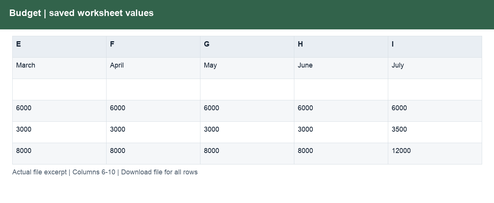
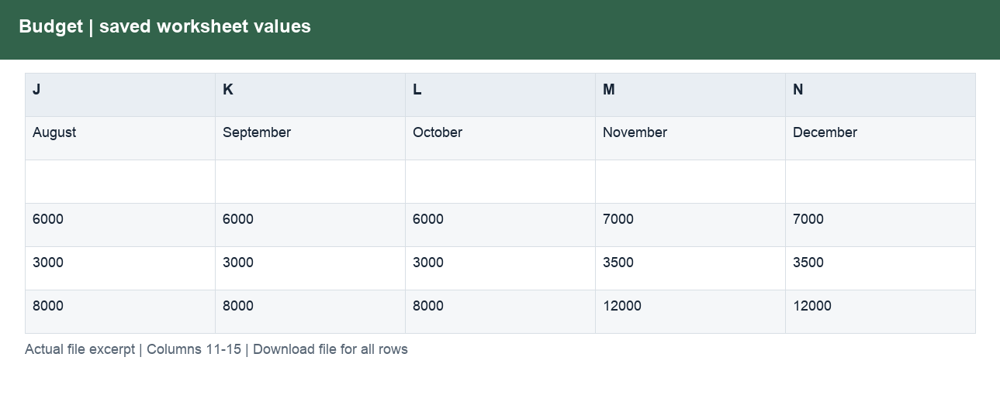
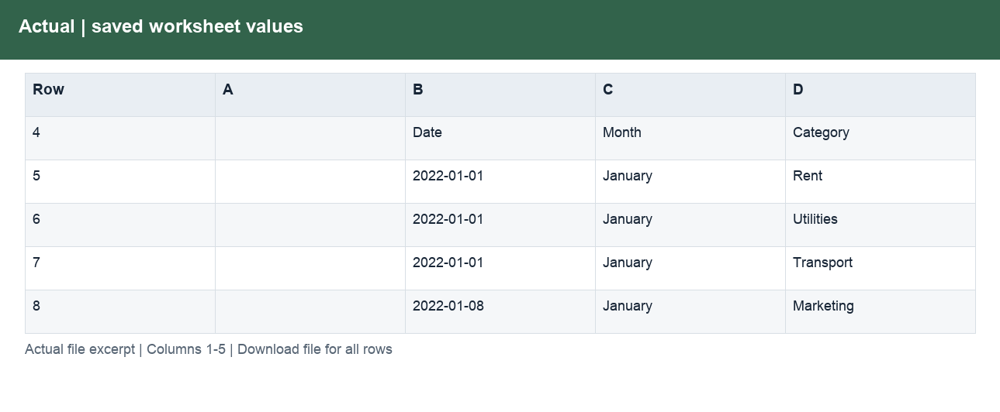
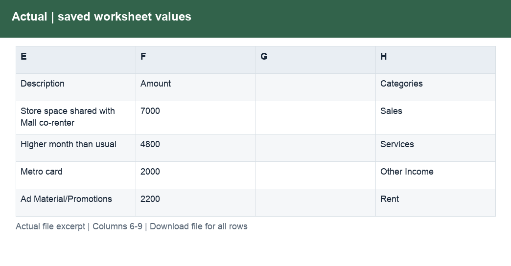

# Budget_vs_Actuals_Original.xlsx

[Download workbook](<../Budget_vs_Actuals_Original.xlsx>) · [Back to data guide](../README.md)

This page renders saved cell values from the actual workbook. Excel workbooks mix schedules, assumptions and tables, so formats are documented by worksheet and column rather than treating the whole file as one dataset. No calculations or source cells were changed for these illustrations.

## Interactive Dashboard

Provide a prepared table for consistent joins, filtering and analysis.

| Column | Labels / sample content | Stored type and Excel number format |
|---|---|---|
| A | Numeric schedule values | ;  |
| B | Current Month :; Figures in USD; Income: | str; General |
| C | March; Budget | int, str; #,##0_);\(#,##0\);\-\-_); General |
| D | Actual; ` | int, str; #,##0_);\(#,##0\);\-\-_); General |
| E | Numeric schedule values | ;  |
| F | Budget vs. Actual Dashboard; Variance (Absolute) | int, str; #,##0_);\(#,##0\);\-\-_); General |
| G | Variance ( % ) | float, int, str; 0.0%_);\(0.0%\);\-\-_); General |
| H | Numeric schedule values | ;  |
| I | Variance (Budget vs Actual) Income:; Variance (Budget vs Actual) Expenses: | str; General |

Column labels may change between sections lower in the worksheet. Download the workbook to follow those schedules and formulas; the illustration shows only the opening populated section.

## Budget

Provide a prepared table for consistent joins, filtering and analysis.

| Column | Labels / sample content | Stored type and Excel number format |
|---|---|---|
| A | Numeric schedule values | ;  |
| B | Budgeted Income & Expenses 2022; Figures in USD; Income: | str; General |
| C | January | int, str; #,##0_);\(#,##0\);\-\-_); mmm-yy |
| D | February | float, int, str; #,##0_);\(#,##0\);\-\-_); mmm-yy |
| E | March | int, str; #,##0_);\(#,##0\);\-\-_); mmm-yy |
| F | April | int, str; #,##0_);\(#,##0\);\-\-_); mmm-yy |
| G | May | int, str; #,##0_);\(#,##0\);\-\-_); mmm-yy |
| H | June | int, str; #,##0_);\(#,##0\);\-\-_); mmm-yy |
| I | July | int, str; #,##0_);\(#,##0\);\-\-_); mmm-yy |
| J | August | int, str; #,##0_);\(#,##0\);\-\-_); mmm-yy |
| K | September | int, str; #,##0_);\(#,##0\);\-\-_); mmm-yy |
| L | October | int, str; #,##0_);\(#,##0\);\-\-_); mmm-yy |
| M | November | int, str; #,##0_);\(#,##0\);\-\-_); mmm-yy |
| N | December | int, str; #,##0_);\(#,##0\);\-\-_); mmm-yy |

Column labels may change between sections lower in the worksheet. Download the workbook to follow those schedules and formulas; the illustration shows only the opening populated section.

## Actual

Provide a prepared table for consistent joins, filtering and analysis.

| Column | Labels / sample content | Stored type and Excel number format |
|---|---|---|
| A | Numeric schedule values | ;  |
| B | Actual Income & Expenses 2022; Date | datetime, str; General; d-mmm |
| C | Month; January; January | str; General |
| D | Category; Rent; Utilities | str; General |
| E | Description; Store space shared with Mall co-renter; Higher month than usual | str; General |
| F | Amount | int, str; #,##0_);\(#,##0\);\-\-_); General |
| G | Numeric schedule values | ;  |
| H | Categories; Sales; Services | str; General |

Column labels may change between sections lower in the worksheet. Download the workbook to follow those schedules and formulas; the illustration shows only the opening populated section.

